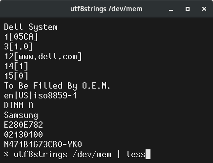

# utf8strings
Extract strings of UTF-8 (four characters or longer) from binary blobs.

# Usage

    Compilation:
        make utf8strings

    Usage:
        utf8strings [ filename ]

    Examples:
        utf8strings /usr/sbin/bomb
        utf8strings /dev/mem | less
        somebinaryemittingprogram | utf8strings 

# Why?

"Binary" files often have text strings embedded in them, but the
standard `strings` utility that comes with [GNU
binutils](https://gnu.org/software/binutils/) does not (yet)
understand UTF-8. This is a serious problem because UTF-8 has become
the defacto standard for text in UNIX systems and on the Internet.

# How

UTF-8 is a beautiful design and includes the ability to _self
synchronize_. Each character in a UTF-8 string is made up of a
sequence of up to four bytes. By looking at the first two bits of a
byte, one knows immediately if the byte represents an ASCII character
(00, 01), an initial byte in a sequence (11), or a continuation byte
(10). That means that there is never any confusion about possibly
overlapping UTF-8 interpretations.

# Initial release 

This was designed to be simple and correct. It was implemented in
bog-standard C. No thought was put in to optimization, yet. It
correctly identifies valid UTF-8 sequences and rejects non-UTF-8. It
shows strings with a minimum length of four *characters* (not bytes).
Works on stdin or a single filename may be specified.

It works for my purposes and probably will be fine for you as well.

# Deficiencies
* Hardcoded to strings of minlength 4. 
* Could be a lot faster with some simple optimizations.
* Does not handle any options.
* Should be merged with `strings` from GNU binutils.

# Future

I've licensed this code under the same license as GNU binutils in the
hope that it will be useful to the GNU folks as they improve the
official version of `strings` to support UTF-8.

# Implementation Notes

## A. INVALID UTF-8 SEQUENCES are correctly discarded:
For example,
   1. Bytes that don't begin with UTF's magic (10*, 110*, 1110*, or 11110*).
   2. A byte with the correct magic bits, but all 0s for data. (E.g., 11110000).
   3. Incorrect usage of continuation bytes (10*) 
      1. After 110*, there must be one continuation byte.
      2. After 1110*, there must be two continuation bytes.
      3. After 11110*, there must be three continuation bytes.
      4. Continuation bytes (10*) not preceeded by one of the above are invalid.
   4. Bytes C0 and C1. (They would encode ASCII as two bytes).
   5. U+D800 to U+DFFF are reserved for UTF-16's surrogate halves.
   6. Leading byte of F4 and codepoint is beyond Unicode's limit. (>0x10FFFF)
   7. Leading byte of F5 to FD. (Codepoint is greater than 0x10FFFF).
   8. Leading byte of FE or FF. (Undefined in UTF-8 to allow for UTF-16 BOM).
   9. Code points U+80 to U+9F are skipped as control characters.
  10. End of file before a complete character is read.

## B. MAYBE IT COULD BE BETTER.

   Some valid UTF-8 sequences are actually undefined code points in
   Unicode and shouldn't be printed. Similarly, for a `strings`
   program like this, we would want to check Unicode's syntactic
   tables so we can ignore non-printable characters. Those features
   have been left out intentionally as they would be much more complex
   and require updating with every new release of the Unicode
   standard.

## C. SOME TESTS:
   1a. Values beyond Unicode (>= 0x110000) should NOT be shown:

       echo -n $'XX\xf4\x90\x80\x80XX' | ./utf8strings  | hd

   1b. Characters <= 0x10FFFF should show something:

       echo -n $'XX\xf4\x8f\xbf\xbfXX' | ./utf8strings  | hd

   2a. UTF-16 surrogate halves should NOT be shown:

       echo -n $'XX\xED\xA0\x80XX' | ./utf8strings | hd

   2b. Characters between U+D000 to U+D7FF should be shown:

       echo -n $'XX\xED\x9F\xBFXX' | ./utf8strings | hd

   3a. UTF-8 Control characters 0x80 to 0x9F should NOT be shown:

       echo $'XX\xC2\x80XX'  | ./utf8strings | hd

   3b. Characters >= 0xA0 should be shown:

       echo $XX'\xC2\xA0XX'  | ./utf8strings | hd
